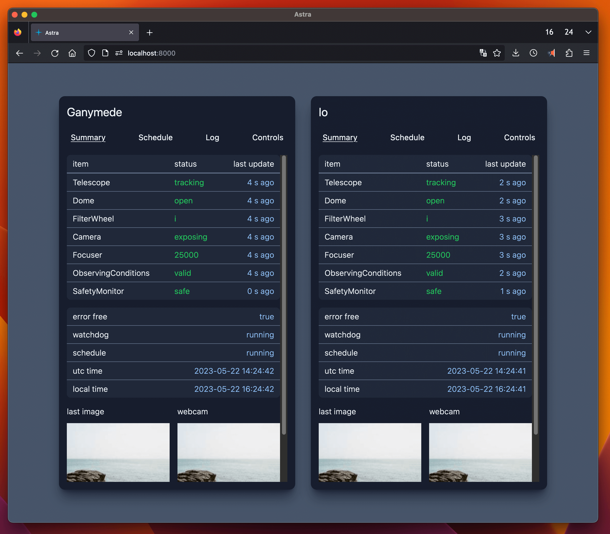

# Astra - Automated Survey observaTory Robotised with Alpaca

Astra is an open-source observatory control software designed for automating and managing the operations of a survey observatory. It is built to work seamlessly with ASCOM Alpaca.


## Work in Progress

\***Disclaimer: Astra is currently a work in progress. Use it at your own risk.**\*

Works currently in progress are listed in the [issues tab](https://github.com/ppp-one/astra/issues).

## Features

🧑‍💻 **Remote Control**: Astra enables remote control of observatory equipment, allowing you to operate the observatory from anywhere in your local network, or anywhere with an internet connection when using a VPN or a tunneling service.

🤖 **Automated**: You can schedule and execute automated sequences using Astra. Define observation targets, parameters, start and end times, and let Astra handle the rest.

🦙 **Alpaca Integration**: Astra leverages the Alpyca python library to provide seamless integration with a wide range of astronomy equipment, permitting easy scalability to multiple telescopes, cameras, filter wheels, domes, weather stations, focusers, switches, cover calibrators, and rotators.

## Getting Started

(TODO: video tutorial)

### Installation

Clone the Astra Github repository with

```
git clone https://github.com/ppp-one/astra.git
```

and create a virtual environment with conda

```
conda create -n astra python=3.11
conda activate astra
```

then install Astra locally with

```
cd astra
pip install -e .
```

### Usage

1. Have Alpaca compliant equipment or [simulators](https://github.com/ASCOMInitiative/ASCOM.Alpaca.Simulators) active in your local network.
2. Then run the following commands to start Astra:

```
python src/astra/main.py
```

3. Follow the terminal instructions.
4. Once 3. completed, open the browser and go to `http://localhost:8000/` to access Astra.

Below is a screenshot of Astra working at SPECULOOS:



## Contributing

Contributions are welcome and appreciated! If you want to contribute to Astra, please follow the guidelines outlined in [CONTRIBUTING.md](CONTRIBUTING.md).

## License

Astra is released under the GNU General Public License v3.0. See [LICENSE](LICENSE) for more details. In short, this means that you are free to use, modify, and distribute Astra as long as you make your modifications available under the same license.

## Contact

If you have any questions, suggestions, or feedback, please leave an issue on the GitHub repository.
