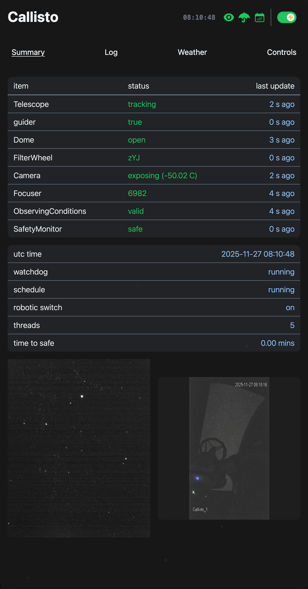
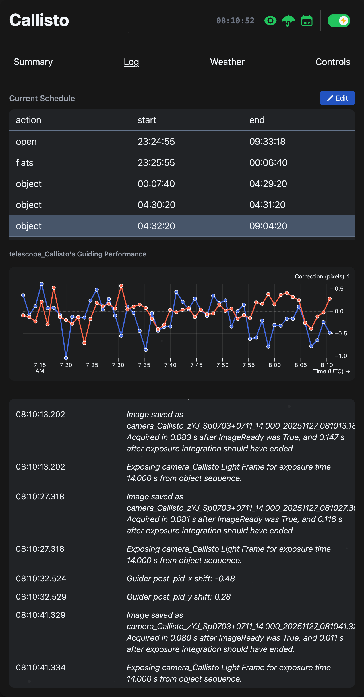
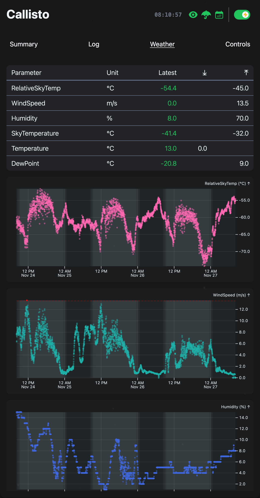
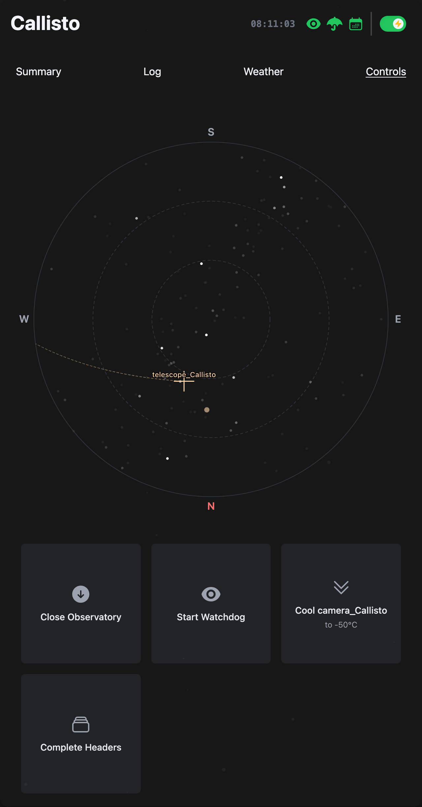

# Astra Documentation

```{image} _static/astra-banner.jpg
:width: 100%
:align: center
:alt: Astra banner
```

**Astra** (Automated Survey observaTory Robotised with Alpaca) is an open-source,
cross-platform Python system for the sustained, fully autonomous operation of
astronomical observatories.

_Astra_ controls observatory devices via the **ASCOM Alpaca protocol**. It can execute prescheduled observatory actions under continuous weather safety supervision,
such as object observations with plate-solve-based pointing correction using an offline Gaia–2MASS catalogue, PID-controlled autoguiding, sky-flats, and autofocusing.

A FastAPI web interface provides a browser UI, alongside REST and WebSocket APIs for real-time status monitoring, image previews, and interaction with the SQLite-backed database.

## Used By

Currently, _Astra_ is deployed at multiple professional observatories
delivering reliable, unattended survey operations, including:

- SPECULOOS-South (4x 1 m class): Paranal, Chile
- Saint-Ex (1 m class): San Pedro Mártir, Mexico
- ETH Observatory (0.5 m class): Zurich, Switzerland

## Screenshots

<table>
  <tr>
    <td width="24%">
      
      <p align="center"><em>Observatory overview</em></p>
    </td>
    <td width="24%">
      
      <p align="center"><em>System logs</em></p>
    </td>
    <td width="24%">
      
      <p align="center"><em>Weather monitoring</em></p>
    </td>
    <td width="24%">
      
      <p align="center"><em>Controls tab</em></p>
    </td>
  </tr>
</table>

<table style="margin-top: 20px;">
  <tr>
    <td width="45%">
      
      <p align="center"><em>Schedule editor</em></p>
    </td>
    <td width="45%">
      
      <p align="center"><em>FITS viewer</em></p>
    </td>
  </tr>
</table>

```{note}
This documentation is a work in progress. We are continuously updating and improving it.
If you have any questions or suggestions, please feel free to reach out to us.
We appreciate your feedback and contributions to make this documentation better. Please use _Astra_ at your own risk.
```

---

<!-- ```{toctree}
:hidden:

motivation
``` -->

```{toctree}
:maxdepth: 2
:caption: Getting Started
:hidden:

installation
quickstart
```

```{toctree}
:maxdepth: 2
:caption: User Guide
:hidden:

user_guide/overview
user_guide/observatory_configuration
user_guide/fits_header_configuration
user_guide/scheduling
user_guide/operation
user_guide/custom_observatories
```

```{toctree}
:maxdepth: 2
:caption: Developer Documentation
:hidden:

api/index
api/endpoints
contributing
```
