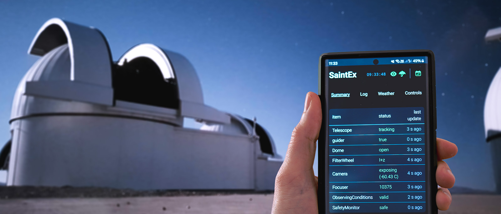

Astra Documentation
==================

**Astra** (Automated Survey observaTory Robotised with Alpaca) is a Python based observatory control software. Designed for automating astronomical observatory operations.

Features
--------

* Fully robotic observatory control
* Multi-device ASCOM Alpaca protocol support
* Python based, cross-platform compatibility (Windows, Linux, MacOS)
* Web-based user interface and API

Used By
-------

Astra is already used at multiple observatories around the world, including:

* SPECULOOS-South: Paranal, Chile
* Saint-Ex: San Pedro Mártir, Mexico
* ETH Observatory: Zurich, Switzerland
.. * SPECULOOS-North: Teide Observatory, Tenerife, Spain ... soon

.. note::

   This documentation is a work in progress. We are continuously updating and improving it. If you have any questions or suggestions, please feel free to reach out to us.
   We appreciate your feedback and contributions to make this documentation better.

Documentation last updated: |today|

.. toctree::
   :maxdepth: 2
   :caption: Contents:
   :hidden:

   installation
   getting_started
   user_guide/index
   api/index
   contributing
   changelog